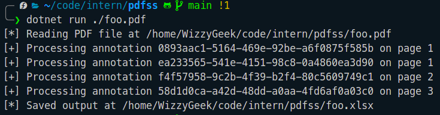
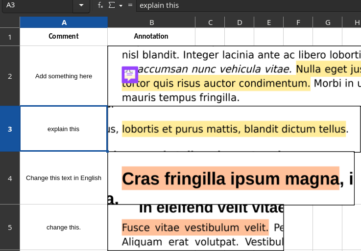

# PDFSS

A simple .NET tool to extract highlighted annotations in a PDF into an Excel Sheet.

## Usage

```
Usage:
        pdfss <FILE> [-o/--output <FILE>]

        <FILE>          The PDF file to process
        -o/--output     The destination path of the generated .xlsx file
```

## Examples



